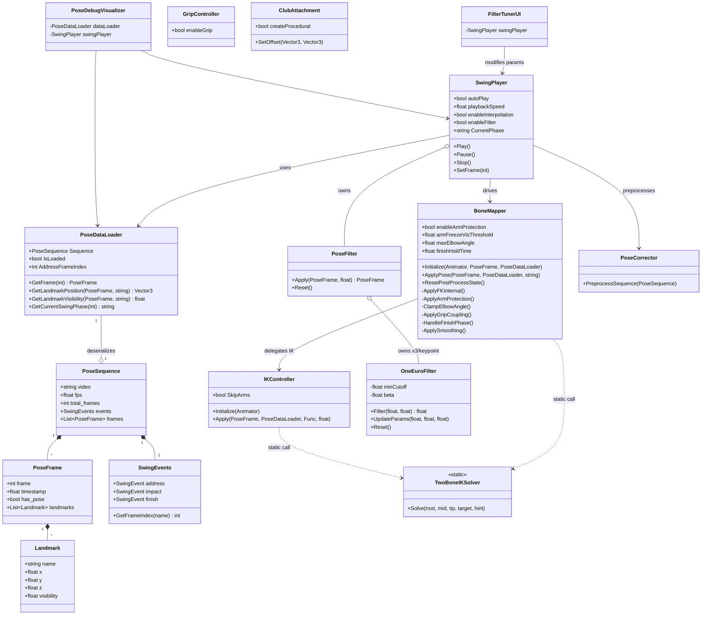

# GolfSimulation — 문서 작성용 원본 자료 (for_doc.md)

> 이 파일은 **프로그램 목록**, **프로그램 설계서**, **클래스 다이어그램** 작성에 필요한
> 모든 원본 정보를 담고 있습니다.
> 작성일: 2026-04-17

---

## 1. 프로젝트 기본 정보

| 항목 | 내용 |
|------|------|
| **프로젝트명** | GolfSimulation |
| **목적** | 모바일 골프 스윙 영상에서 추출한 MediaPipe 포즈 데이터를 Unity Humanoid 아바타(Y-Bot)에 절차적으로 적용하여 3D 골프 스윙 동작을 재현 |
| **Unity 버전** | 6000.3.6f1 (Unity 6.3 LTS) |
| **렌더 파이프라인** | URP (Universal Render Pipeline) v17.3.0 |
| **아바타** | Mixamo Y-Bot (T-Pose, FBX, Humanoid 리그) |
| **언어** | C# (Unity 스크립팅) |
| **외부 패키지** | Newtonsoft Json (com.unity.nuget.newtonsoft-json v3.2.2), Animation Rigging v1.4.1 |
| **포즈 데이터 출처** | MediaPipe Pose (17 keypoints) + Python 추출 파이프라인 |
| **데이터 포맷** | JSON (golf_swing_pose.json, StreamingAssets 배치) |
| **fps** | 데이터: 29.97fps / 렌더링: 60fps+ (Slerp 보간) |
| **좌표 변환** | DataToAvatarSpace: (-x, y, -z) |

---

## 2. 프로그램 목록 (전체 스크립트)

### 2-1. 구현 완료 스크립트

| # | 파일명 | 네임스페이스 | 상속 | 역할 | 담당 Phase |
|---|--------|-------------|------|------|------------|
| 1 | `PoseData.cs` | GolfSimulation.Data | — (POCO) | JSON 직렬화 데이터 구조체 전체 정의 | Phase 1 |
| 2 | `PoseDataLoader.cs` | GolfSimulation.Data | MonoBehaviour | JSON 파일 로딩, 프레임 조회, 스윙 페이즈 판별 | Phase 1 |
| 3 | `BoneMapper.cs` | GolfSimulation.Core | MonoBehaviour | 키포인트→본 회전 변환, 5단계 파이프라인 총괄 | Phase 2, 7 |
| 4 | `SwingPlayer.cs` | GolfSimulation.Core | MonoBehaviour | 프레임 타임라인 재생, 보간, 필터, 페이즈 트래킹 | Phase 2, 5 |
| 5 | `SpineResolver.cs` | GolfSimulation.Resolver | MonoBehaviour | X-Factor 계산 + Spine/Chest/UpperChest 회전 분배 | Phase 3 |
| 6 | `HeadResolver.cs` | GolfSimulation.Resolver | MonoBehaviour | Neck, Head 회전 계산 (delta 기반) | Phase 3 |
| 7 | `IKController.cs` | GolfSimulation.IK | MonoBehaviour | 팔/다리 TwoBoneIK + visibility 블렌딩 | Phase 4 |
| 8 | `TwoBoneIKSolver.cs` | GolfSimulation.IK | static class | Law of Cosines 기반 Two-Bone IK 솔버 | Phase 4 |
| 9 | `OneEuroFilter.cs` | GolfSimulation.Filter | — (POCO) | 단일 스칼라 1€ 필터 구현 | Phase 5 |
| 10 | `PoseFilter.cs` | GolfSimulation.Filter | — (POCO) | 17 키포인트 × 3축에 OneEuroFilter 적용 | Phase 5 |
| 11 | `FilterTunerUI.cs` | GolfSimulation.Filter | MonoBehaviour | 런타임 필터 파라미터 조정 GUI 창 | Phase 5 |
| 12 | `GripController.cs` | GolfSimulation.Grip | MonoBehaviour | 손가락 5개 Curl/Spread 정적 그립 포즈 적용 | Phase 6 |
| 13 | `ClubAttachment.cs` | GolfSimulation.Grip | MonoBehaviour | 골프 클럽 부착 (외부 모델 또는 절차적 생성) | Phase 6 |
| 14 | `PoseCorrector.cs` | GolfSimulation.Correction | MonoBehaviour | 재생 전 포즈 시퀀스 전처리 (3단계 보정) | Post-Phase 6 |
| 15 | `PoseDebugVisualizer.cs` | GolfSimulation.Utility | MonoBehaviour | Scene 뷰 Gizmo — 17개 키포인트 + 스켈레톤 시각화 | Phase 1 |

### 2-2. 미구현 예정 스크립트 (Phase 7D / 이후)

| # | 파일명 | 네임스페이스 | 역할 | 담당 Phase |
|---|--------|-------------|------|------------|
| 16 | `ReferenceAnimationSampler.cs` | GolfSimulation.Core | Mixamo AnimationClip에서 SwingNet 8이벤트 타임스탬프로 본 회전 샘플링 | Phase 7D |
| 17 | `HybridBlender.cs` | GolfSimulation.Core | 키포인트 FK 포즈 + 참조 애니메이션 본별 가중치 블렌딩 | Phase 7D |

### 2-3. Python 데이터 파이프라인 스크립트

| # | 파일명 | 위치 | 역할 |
|---|--------|------|------|
| 18 | `fix_swingnet_events.py` | GolfSwingData/ | SwingNet 모델로 이벤트 재감지, *_unity.json 이벤트 필드 수정 |

---

## 3. 시스템 아키텍처

### 3-1. 전체 데이터 흐름

```
[Python 파이프라인]
  영상 (MP4) → MediaPipe Pose 추출 → 17 keypoints + SwingNet 이벤트
  → golf_swing_pose.json (StreamingAssets/)

[Unity 런타임]
  ┌─────────────────────────────────────────────────────────┐
  │ PoseDataLoader                                          │
  │  └── JSON 파싱 → PoseSequence (프레임 배열 + 이벤트)     │
  └─────────────────────────────────────────────────────────┘
           │
           ▼
  ┌─────────────────────────────────────────────────────────┐
  │ SwingPlayer (LateUpdate 루프)                           │
  │  1. 시간 진행 → frameA, frameB 결정                     │
  │  2. InterpolateFrames(frameA, frameB, t) — Slerp 보간   │
  │  3. PoseFilter.Apply() — One Euro Filter 노이즈 제거     │
  │  4. BoneMapper.ApplyPose(frame, loader, phase)          │
  └─────────────────────────────────────────────────────────┘
           │
           ▼
  ┌─────────────────────────────────────────────────────────┐
  │ BoneMapper — 5단계 파이프라인                           │
  │  Stage 1: ApplyFKInternal()  — FK 회전 (Position→Quat) │
  │  Stage 2: ApplyArmProtection() — 팔 보호 (Phase 7A/B)  │
  │  Stage 3: ApplyGripCoupling() — 오른팔 IK 커플링        │
  │  Stage 4: IKController.Apply() — visibility IK 블렌딩  │
  │  Stage 5: HandleFinishPhase() — finish 포즈 hold        │
  │  Stage 6: ApplySmoothing() — 프레임레이트독립 스무딩     │
  │  Stage 7: CacheCurrentPose() — 다음 프레임용 캐시        │
  └─────────────────────────────────────────────────────────┘
           │
           ▼
  [Y-Bot Humanoid 본 최종 회전 → 렌더링]
```

### 3-2. 사전 처리 흐름 (Start 시)

```
SwingPlayer.Start()
  ├── PoseCorrector.PreprocessSequence()   ← 재생 전 시퀀스 전처리
  │     ├── P3 JumpRejection (전 관절)
  │     ├── P1 DepthClamping (face_on 전용, 팔 단위)
  │     └── P2 GripConstraint (손목 간격 제한)
  └── BoneMapper.Initialize()
        ├── T-Pose 기준 BoneCache 구성 (restRot, restAimDir)
        ├── Scale Factor 계산 (아바타 hip-ankle / 소스 hip-ankle)
        ├── Address pelvis offset 캐시
        ├── Grip offset 캐시 (address 프레임에서 leftHand→rightHand)
        └── IKController.Initialize()
```

### 3-3. 씬 구성 (Main.unity)

```
[Scene Hierarchy]
  Main Camera
  Directional Light
  GolfSimulationRoot (비어있는 GameObject)
    ├── [Component] PoseDataLoader
    ├── [Component] SwingPlayer
    ├── [Component] BoneMapper
    ├── [Component] IKController
    ├── [Component] PoseCorrector
    ├── [Component] FilterTunerUI
    ├── [Component] PoseDebugVisualizer
    └── Y Bot (FBX 인스턴스)
          ├── [Component] Animator (Humanoid, enabled=false at runtime)
          ├── [Component] GripController
          └── [Component] ClubAttachment
```

---

## 4. 모듈별 상세 설계

---

### 4-1. [Data] PoseData.cs

**역할**: JSON 역직렬화용 데이터 클래스 전체 정의.  
**패턴**: 순수 데이터 클래스(POCO), MonoBehaviour 아님.

#### 클래스 목록

| 클래스 | 설명 |
|--------|------|
| `PoseSequence` | 최상위 루트. video, fps, total_frames, 이벤트, 프레임 배열 |
| `PoseFrame` | 단일 프레임. frame 인덱스, timestamp, has_pose, Landmark 리스트 |
| `Landmark` | 단일 키포인트. name, x, y, z, visibility |
| `SwingEvents` | 8개 스윙 이벤트 (address~finish). GetEvent(name), GetFrameIndex(name) 제공 |
| `SwingEvent` | 단일 이벤트. frame 인덱스 + timestamp |
| `FixesApplied` | 전처리 메타데이터. anchor_frame, visibility_threshold, total_keypoints_replaced |
| `ConversionInfo` | 좌표 변환 방식 설명 문자열 4단계 |
| `OriginalSize` | 원본 영상 해상도 (width, height) |
| `AnchorValue` | anchor 키포인트의 x, y 좌표 |

#### 17개 키포인트 이름 (MediaPipe Pose)

```
nose, left_eye, right_eye, left_ear, right_ear,
left_shoulder, right_shoulder,
left_elbow, right_elbow,
left_wrist, right_wrist,
left_hip, right_hip,
left_knee, right_knee,
left_ankle, right_ankle
```

---

### 4-2. [Data] PoseDataLoader.cs

**역할**: StreamingAssets에서 JSON 로딩, 프레임/키포인트 조회 API, 스윙 페이즈 판별.

#### 주요 멤버

| 종류 | 이름 | 설명 |
|------|------|------|
| Field | `fileName` | 로딩할 파일명 (기본: golf_swing_pose.json) |
| Property | `Sequence` | 파싱된 PoseSequence |
| Property | `IsLoaded` | 로딩 성공 여부 |
| Property | `AddressFrameIndex` | address 이벤트 프레임 인덱스 |
| Method | `GetFrame(int)` | 특정 인덱스 PoseFrame 반환 |
| Method | `GetAddressFrame()` | address 이벤트 프레임 반환 |
| Method | `GetLandmarkPosition(PoseFrame, string)` | 키포인트 Vector3 좌표 반환 |
| Method | `GetLandmarkVisibility(PoseFrame, string)` | 키포인트 visibility 반환 |
| Method | `GetCurrentSwingPhase(int)` | 프레임 인덱스 → 현재 스윙 페이즈 문자열 반환 |

#### 스윙 페이즈 판별 로직

```
판별 순서 (역순): finish → mid_follow_through → impact → mid_downswing
                → top → mid_backswing → toe_up → address → setup
frameIndex >= event.frame 인 가장 앞선 이벤트가 현재 페이즈
```

---

### 4-3. [Core] BoneMapper.cs

**역할**: 전체 본 매핑 파이프라인의 핵심. FK → 팔보호 → IK → Finish → Smooth 5단계 실행.

#### Inspector 파라미터

| 헤더 | 파라미터 | 기본값 | 설명 |
|------|---------|--------|------|
| Scale | positionScale | 1.0 | 루트 위치 보정 배율 |
| Spine Weights | spineWeight | 0.25 | Spine의 어깨 추종 비율 |
| Spine Weights | chestWeight | 0.55 | Chest의 어깨 추종 비율 |
| Spine Weights | upperChestWeight | 0.85 | UpperChest의 어깨 추종 비율 |
| Grip Coupling | enableGripCoupling | true | 오른팔 grip coupling 활성 |
| Rotation Smoothing | enableSmoothing | true | 프레임레이트독립 스무딩 |
| Finish Blend | enableFinishBlend | true | finish 포즈 hold 활성 |
| Finish Blend | finishVisThreshold | 0.5 | visibility 기반 finish blend 기준 |
| Finish Blend | finishHoldTime | 0.5s | finish 진입 후 hold 완료까지 시간 |
| Arm Protection | enableArmProtection | true | 팔 보호 활성 |
| Arm Protection | armFreezeVisThreshold | 0.35 | 이 값 미만이면 이전 포즈로 고정 |
| Arm Protection | maxElbowAngle | 140° | 팔꿈치 최대 굴곡 각도 |

#### 5단계 파이프라인 (ApplyPose 호출 순서)

```
1. UpdatePhaseParameters(phase)
   └─ 페이즈별 responsiveness, gripWeight 설정

2. ApplyFKInternal(frame, loader)
   ├─ Hips: pelvis중점 → position + ApplyAimTwist(trunkDir, hipRight)
   ├─ Spine Chain: Slerp(hipRight, shoulderRight, weight) → ApplyAimTwist
   ├─ Neck: earCenter - shoulderCenter 방향 → ApplyAimTwist
   ├─ Head: nose - earCenter + Cross(headFwd, earVector) → ApplyAimTwist
   ├─ 팔 (4본): ApplyLimb (shoulder→elbow, elbow→wrist)
   └─ 다리 (4본): ApplyLimb (hip→knee, knee→ankle)

3. ApplyArmProtection(frame, loader)  [Phase 7A/B]
   ├─ A. ClampElbowAngle(left, right) — 과신전 방지
   └─ B. visibility < 0.35 → 이전 프레임 Slerp 고정

4. ApplyGripCoupling()
   └─ leftHand.TransformPoint(gripOffsetLocal) → TwoBoneIKSolver.Solve(rightArm)

5. IKController.Apply()
   └─ visibility < 0.7 구간에서 손목/발목 IK로 관절 보정

6. HandleFinishPhase(phase)
   ├─ impact/mid_follow_through: CaptureFinishPose()
   └─ finish: max(visWeight, SmoothStep(timer/holdTime)) → ApplyFinishBlend

7. ApplySmoothing()
   └─ smoothLerp = 1 - (1-resp)^(dt*60) → Slerp(prevRot, currRot, smoothLerp)

8. CacheCurrentPose()
```

#### 좌표 변환 공식

```
DataToAvatarSpace(v) = (-v.x, v.y, -v.z)
```

#### ApplyAimTwist 알고리즘

```
1. aim = FromToRotation(bone.restUp, aimTarget)
2. afterAim = aim * bone.restRot
3. aimedRight = afterAim * Vector3.right (평면 투영)
4. angle = SignedAngle(projAimedRight, projTargetRight, aimTarget)
5. twist = AngleAxis(angle, aimTarget)
6. bone.rotation = twist * afterAim
```

#### ApplyLimb 알고리즘

```
dir = (to - from).normalized
delta = FromToRotation(bone.restAimDir, dir)
bone.rotation = delta * bone.restRot
```

---

### 4-4. [Core] SwingPlayer.cs

**역할**: 재생 루프 관리. 시간 진행, 프레임 보간, 필터 적용, BoneMapper 호출.

#### Inspector 파라미터

| 파라미터 | 기본값 | 설명 |
|---------|--------|------|
| autoPlay | true | Start 시 자동 재생 |
| loop | true | 끝에서 처음으로 루프 |
| playbackSpeed | 1.0 | 재생 속도 배율 |
| enableInterpolation | true | Slerp 보간 (29.97→60fps) |
| enableFilter | true | One Euro Filter 활성 |
| filterMinCutoff | 1.0 | 필터 최소 차단 주파수 |
| filterBeta | 0.007 | 속도 계수 (빠른 동작 반응성) |
| filterDCutoff | 1.0 | 미분 필터 차단 주파수 |
| enablePoseCorrection | true | PoseCorrector 전처리 활성 |

#### 공개 API

| 메서드/프로퍼티 | 설명 |
|----------------|------|
| `Play()` | 재생 시작 |
| `Pause()` | 일시정지 |
| `Stop()` | 정지 + 상태 초기화 |
| `SetFrame(int)` | 특정 프레임으로 이동 |
| `CurrentFrameIndex` | 현재 프레임 인덱스 |
| `CurrentPhase` | 현재 스윙 페이즈 문자열 |
| `TotalFrames` | 전체 프레임 수 |
| `EnableFilter`, `FilterMinCutoff`, `FilterBeta`, `FilterDCutoff` | 런타임 파라미터 (FilterTunerUI 연동) |

#### LateUpdate 재생 루프

```
playbackTime += deltaTime * playbackSpeed
framePos = playbackTime / frameDuration
frameA = Floor(framePos)
frameB = frameA + 1
t = framePos - frameA

if enableInterpolation: frame = InterpolateFrames(A, B, t)
if enableFilter:        frame = PoseFilter.Apply(frame, playbackTime)
BoneMapper.ApplyPose(frame, loader, phase)
```

---

### 4-5. [Resolver] SpineResolver.cs

**역할**: 어깨·골반 벡터로부터 Spine/Chest/UpperChest 회전 계산. X-Factor 시각화.

#### 핵심 설계 결정

- `trunkUp = Vector3.up` 고정 (데이터 기반 trunkUp 사용 시 pitch 오류 발생하여 고정)
- 첫 프레임을 기준으로 delta만 적용 (T-Pose 오프셋 제거)
- `Slerp(hipRight, shoulderRight, weight)` 로 각 본의 회전량 조절

#### 공개 메서드

| 메서드 | 파라미터 | 설명 |
|--------|---------|------|
| `Initialize(Animator)` | animator | 본 참조 취득, T-Pose 캐시 |
| `Resolve(Vector3×4)` | lShoulder, rShoulder, lHip, rHip | 프레임별 Spine 회전 적용 |
| `LastXFactor` (prop) | — | 마지막 계산된 X-Factor 각도(도) |

---

### 4-6. [Resolver] HeadResolver.cs

**역할**: Neck(earCenter 방향)과 Head(LookRotation)를 delta 방식으로 적용.

#### 핵심 알고리즘

```
Neck:
  neckDir = normalize(earCenter - shoulderCenter)
  neckDelta = FromToRotation(dataRestNeckDir, neckDir)
  neck.rotation = neckDelta * neckRestRot

Head:
  headForward = normalize(nose - earCenter)
  headUp = Cross(headForward, earVector)  [earVector = rEar - lEar]
  currentHeadRot = LookRotation(headForward, headUp)
  headDelta = currentHeadRot * Inverse(restHeadDataRot)
  head.rotation = headDelta * headRestRot
```

---

### 4-7. [IK] IKController.cs

**역할**: 팔/다리 4개 체인에 TwoBoneIK 적용. visibility에 따라 FK와 IK를 블렌딩.

#### IK 가중치 계산

```
visibility >= 0.7 → IK weight = 0 (FK 100%)
visibility <= 0.3 → IK weight = 1 (IK 100%)
0.3 < vis < 0.7  → 선형 보간
```

#### SkipArms 플래그

`BoneMapper`에서 Grip Coupling이 활성화된 경우 `SkipArms = true` 설정 → 팔 IK 건너뜀.

---

### 4-8. [IK] TwoBoneIKSolver.cs

**역할**: Law of Cosines 기반 Two-Bone IK. 정적 유틸리티 클래스.

#### Solve 알고리즘

```
1. 체인 길이 계산: upperLen, lowerLen
2. targetDist 클램프: [|upper-lower|+ε, upper+lower-ε]
3. Law of Cosines → cosRoot → rootAngleRad
4. hint → bendNormal 계산 (hint→target 축 직교 분해)
5. bendAxis = Cross(targetDir, bendNormal)
6. upperDir = AngleAxis(rootAngle, bendAxis) * targetDir
7. root.rotation = FromToRotation(curr→mid, upperDir) * root.rotation
8. mid.rotation = FromToRotation(curr→tip, target→mid) * mid.rotation
```

---

### 4-9. [Filter] OneEuroFilter.cs

**역할**: 단일 float 스칼라에 대한 1€(One Euro) 적응형 로우패스 필터.

#### 파라미터

| 파라미터 | 설명 |
|---------|------|
| `minCutoff` | 정지 상태 스무딩 강도 (낮을수록 강한 스무딩) |
| `beta` | 속도 반응성 계수 (높을수록 빠른 동작에 반응) |
| `dCutoff` | 미분 필터 차단 주파수 |

#### 필터 공식

```
dt = timestamp - prevTimestamp
dAlpha = 2π·dCutoff·dt / (2π·dCutoff·dt + 1)
filteredDerivative = dAlpha * (value-prevValue)/dt + (1-dAlpha) * prevDerivative
cutoff = minCutoff + beta * |filteredDerivative|
alpha = 2π·cutoff·dt / (2π·cutoff·dt + 1)
filteredValue = alpha * value + (1-alpha) * prevValue
```

---

### 4-10. [Filter] PoseFilter.cs

**역할**: 17개 키포인트 × 3축 (x,y,z)에 각각 독립적인 OneEuroFilter 적용.

#### 구조

```
Dictionary<string, OneEuroFilter[3]>
  "nose"        → [FilterX, FilterY, FilterZ]
  "left_elbow"  → [FilterX, FilterY, FilterZ]
  ...  (17개 키포인트)
```

---

### 4-11. [Filter] FilterTunerUI.cs

**역할**: 런타임 GUI 창으로 One Euro Filter 파라미터를 실시간 조정.

#### 조작 항목

- Interpolation ON/OFF 토글
- Filter ON/OFF 토글
- MinCutoff 슬라이더 [0.01, 10]
- Beta 슬라이더 [0, 1]
- DCutoff 슬라이더 [0.1, 5]
- Reset to Defaults 버튼

---

### 4-12. [Correction] PoseCorrector.cs

**역할**: 재생 전 시퀀스 전체를 순회하며 3가지 전처리 보정 적용. `PreprocessSequence` 한 번만 호출.

#### 3단계 보정 파이프라인 (우선순위 순)

| Priority | 기능 | 로직 |
|----------|------|------|
| P1 (face_on 전용) | Depth Clamping | 팔(어깨-팔꿈치-손목) z좌표가 어깨보다 maxArmBehindShoulder 이상 뒤로 가면 shift |
| P2 | Grip Proximity | 양 손목 거리 > maxWristSeparation 시 오른손목을 왼손목 기준으로 클램핑 |
| P3 | Jump Rejection | 프레임 간 이동거리 > maxJumpPerFrame 시 속도 추정 기반 보간으로 대체 |

#### P3 Jump Rejection 알고리즘

```
hardClamp: |x| or |y| or |z| > 1.5 → 이전 안전 위치로 즉시 복구
softJump:  dist(curr, prev) > maxJumpPerFrame →
  extrapolated = prev + prevVel * 0.5
  corrected = Lerp(extrapolated, curr, 0.15)
```

---

### 4-13. [Grip] GripController.cs

**역할**: 스윙 동작과 독립적으로 손가락 5개 Curl/Spread 정적 포즈를 LateUpdate에서 지속 적용.

#### 관리 본

- 양손 각 5개 손가락 × 3마디 (Proximal, Intermediate, Distal) = 30개 Transform

#### Curl 적용 방식

```
proximal.localRotation   = restRot * spread * AngleAxis(curl * 0.7, axis)
intermediate.localRotation = restRot * AngleAxis(curl * 0.9, axis)
distal.localRotation     = restRot * AngleAxis(curl * 0.5, axis)
```

#### 실행 순서

`[DefaultExecutionOrder(200)]` — BoneMapper 이후 실행 보장

---

### 4-14. [Grip] ClubAttachment.cs

**역할**: LeftHand 본에 골프 클럽을 자식으로 부착. 외부 모델 없으면 절차적 생성.

#### 절차적 클럽 구조 (BuildProceduralClub)

```
GolfClub_Procedural (root)
  ├── Shaft    (Cylinder, 1.1m, 은색)
  ├── Grip     (Cylinder, 0.28m, 흑색)
  └── ClubHead (Cube, 9×2×6.5cm, 어두운 회색, 12° 기울기)
```

#### 실행 순서

`[DefaultExecutionOrder(210)]` — GripController(200) 이후 실행

---

### 4-15. [Utility] PoseDebugVisualizer.cs

**역할**: Scene 뷰에서 현재 프레임 17개 키포인트를 Gizmo로 시각화.

#### 시각화 요소

- 키포인트 구체: visibility에 따라 빨강→초록 그라데이션
- 스켈레톤 연결선: 파란색 Gizmo.DrawLine
- 레이블: 이름 + visibility 수치

---

## 5. 클래스 다이어그램 원시 데이터

### 5-1. 네임스페이스별 클래스 목록

```
GolfSimulation.Data
  ├── PoseSequence  [Serializable]
  ├── PoseFrame     [Serializable]
  ├── Landmark      [Serializable]
  ├── SwingEvents   [Serializable]
  ├── SwingEvent    [Serializable]
  ├── FixesApplied  [Serializable]
  ├── ConversionInfo[Serializable]
  ├── OriginalSize  [Serializable]
  ├── AnchorValue   [Serializable]
  └── PoseDataLoader : MonoBehaviour

GolfSimulation.Core
  ├── BoneMapper : MonoBehaviour
  └── SwingPlayer : MonoBehaviour

GolfSimulation.Resolver
  ├── SpineResolver : MonoBehaviour
  └── HeadResolver : MonoBehaviour

GolfSimulation.IK
  ├── IKController : MonoBehaviour
  └── TwoBoneIKSolver (static class)

GolfSimulation.Filter
  ├── OneEuroFilter
  ├── PoseFilter
  └── FilterTunerUI : MonoBehaviour

GolfSimulation.Correction
  └── PoseCorrector : MonoBehaviour

GolfSimulation.Grip
  ├── GripController : MonoBehaviour
  └── ClubAttachment : MonoBehaviour

GolfSimulation.Utility
  └── PoseDebugVisualizer : MonoBehaviour
```

---

### 5-2. 클래스 상세 (필드/프로퍼티/메서드)

#### PoseSequence
```
Fields:
  + video: string
  + view_type: string
  + original_size: OriginalSize
  + fps: float
  + total_frames: int
  + frames_with_pose: int
  + keypoint_count: int
  + keypoint_names: List<string>
  + events: SwingEvents
  + fixes_applied: FixesApplied
  + conversion: ConversionInfo
  + frames: List<PoseFrame>
```

#### PoseFrame
```
Fields:
  + frame: int
  + timestamp: float
  + has_pose: bool
  + landmarks: List<Landmark>
```

#### Landmark
```
Fields:
  + name: string
  + x: float
  + y: float
  + z: float
  + visibility: float
```

#### SwingEvents
```
Fields:
  + address, toe_up, mid_backswing, top, mid_downswing,
    impact, mid_follow_through, finish: SwingEvent
Methods:
  + GetEvent(name: string): SwingEvent
  + GetFrameIndex(name: string): int
```

#### PoseDataLoader : MonoBehaviour
```
Fields (SerializeField):
  - fileName: string
Properties:
  + Sequence: PoseSequence
  + IsLoaded: bool
  + AddressFrameIndex: int
Methods:
  + LoadData(): void
  + GetFrame(index: int): PoseFrame
  + GetAddressFrame(): PoseFrame
  + GetLandmarkPosition(frame, keypointName): Vector3
  + GetLandmarkVisibility(frame, keypointName): float
  + GetCurrentSwingPhase(frameIndex: int): string
Private:
  - ResolveAddressFrame(): void
```

#### BoneMapper : MonoBehaviour
```
Fields (SerializeField):
  - animator: Animator
  - positionScale: float
  - spineWeight, chestWeight, upperChestWeight: float
  - ikController: IKController
  - enableGripCoupling: bool
  - enableSmoothing: bool
  - enableFinishBlend: bool
  - finishVisThreshold: float
  - finishHoldTime: float
  - enableArmProtection: bool
  - armFreezeVisThreshold: float
  - maxElbowAngle: float
  - showDebugInfo: bool

Private Fields:
  - hipsCache, neckCache, headCache: BoneCache (struct)
  - leftUpperArmCache, leftLowerArmCache,
    rightUpperArmCache, rightLowerArmCache: BoneCache
  - leftUpperLegCache, leftLowerLegCache,
    rightUpperLegCache, rightLowerLegCache: BoneCache
  - spineChain: BoneCache[]
  - spineWeights: float[]
  - leftHandBone, rightHandBone: Transform
  - hipsRestPosition: Vector3
  - sourceToAvatarScale: float
  - addressPelvisOffset: Vector3
  - trackedBones: Transform[]
  - prevRotations, finishRotations: Quaternion[]
  - prevHipsPosition, finishHipsPosition: Vector3
  - gripOffsetLocal: Vector3
  - gripOffsetCaptured, finishPoseCaptured, isInitialized, hasPreviousFrame: bool
  - currentResponsiveness, currentGripWeight: float
  - boneIdxLUA, boneIdxLLA, boneIdxRUA, boneIdxRLA: int  [Phase7]
  - finishBlendTimer: float  [Phase7]

Public Methods:
  + Initialize(animator, referenceFrame, loader): void
  + ApplyPose(frame, loader, phase): void
  + ResetPostProcessState(): void

Private Methods:
  - ApplyFKInternal(frame, loader): void
  - ApplyArmProtection(frame, loader): void  [Phase7A/B]
  - ClampElbowAngle(upper, lower): void      [Phase7A]
  - ApplyGripCoupling(): void
  - HandleFinishPhase(frame, loader, phase): void
  - CaptureFinishPose(): void
  - ComputeFinishBlendWeight(frame, loader): float
  - ApplyFinishBlend(weight): void
  - ApplySmoothing(): void
  - CacheCurrentPose(): void
  - UpdatePhaseParameters(phase): void
  - ApplyAimTwist(ref cache, aimTarget, rightTarget): void
  - ApplyLimb(ref cache, from, to): void
  - DataToAvatarSpace(v): Vector3
  - ComputeScaleFactor(...): void
  - CacheAddressPelvisOffset(loader): void
  - BuildTrackedBoneArray(): void
  - CaptureGripOffset(refFrame, loader): void
  - MakeCache(bone): BoneCache
  - MakeLimbCache(bone, child): BoneCache
```

#### SwingPlayer : MonoBehaviour
```
Fields (SerializeField):
  - dataLoader: PoseDataLoader
  - boneMapper: BoneMapper
  - targetAnimator: Animator
  - autoPlay, loop: bool
  - playbackSpeed: float
  - enableInterpolation, enableFilter, enablePoseCorrection: bool
  - filterMinCutoff, filterBeta, filterDCutoff: float

Private Fields:
  - playbackTime: float
  - currentFrameIndex: int
  - isPlaying: bool
  - frameDuration: float
  - currentPhase: string
  - poseFilter: PoseFilter
  - interpolatedFrame: PoseFrame

Properties:
  + CurrentFrameIndex: int
  + TotalFrames: int
  + IsPlaying: bool
  + CurrentPhase: string
  + EnableInterpolation, EnableFilter: bool
  + FilterMinCutoff, FilterBeta, FilterDCutoff: float

Methods:
  + Play(): void
  + Pause(): void
  + Stop(): void
  + SetFrame(int): void
Private:
  - LateUpdate(): void
  - InterpolateFrames(a, b, t): PoseFrame
  - ValidateReferences(): bool
```

#### SpineResolver : MonoBehaviour
```
Fields (SerializeField):
  - spine, spine1, spine2: Transform
  - spineWeight, spine1Weight, spine2Weight: float

Private Fields:
  - bones: Transform[]
  - weights: float[]
  - boneRestWorldRots, dataRestOrientations: Quaternion[]
  - isInitialized: bool
  - isFirstResolve: bool
  - lastXFactor, lastHipYaw: float

Properties:
  + LastXFactor: float

Methods:
  + Initialize(Animator): void
  + Resolve(lShoulder, rShoulder, lHip, rHip): void
```

#### HeadResolver : MonoBehaviour
```
Fields (SerializeField):
  - neck, head: Transform

Private Fields:
  - neckRestRot, headRestRot: Quaternion
  - dataRestNeckDir, dataRestHeadFwd, dataRestHeadUp: Vector3
  - isInitialized, isFirstFrame: bool

Methods:
  + Initialize(Animator): void
  + Resolve(lShoulder, rShoulder, nose, lEar, rEar): void
```

#### IKController : MonoBehaviour
```
Properties:
  + SkipArms: bool

Private Fields:
  - leftUpperArm, leftLowerArm, leftHand: Transform
  - rightUpperArm, rightLowerArm, rightHand: Transform
  - leftUpperLeg, leftLowerLeg, leftFoot: Transform
  - rightUpperLeg, rightLowerLeg, rightFoot: Transform
  - fkLeft/Right UpperArm/LowerArm/UpperLeg/LowerLeg: Quaternion
  - lastXxxVis, lastXxxWeight: float (진단용)
  - isInitialized: bool

Methods:
  + Initialize(Animator): void
  + Apply(frame, loader, dataToAvatarSpace, scale): void
Private:
  - ComputeIKWeight(visibility): float
  - BackupFK(...): void
  - SolveAndBlend(...): void
```

#### TwoBoneIKSolver (static)
```
Static Methods:
  + Solve(root, mid, tip, targetPos, hintPos): void
```

#### OneEuroFilter
```
Fields:
  - minCutoff, beta, dCutoff: float
  - prevValue, prevDerivative, prevTimestamp: float
  - initialized: bool

Methods:
  + Filter(value: float, timestamp: float): float
  + UpdateParams(minCutoff, beta, dCutoff): void
  + Reset(): void
Private:
  - SmoothingFactor(cutoff, dt): float
```

#### PoseFilter
```
Fields:
  - filters: Dictionary<string, OneEuroFilter[]>
  - cachedFrame: PoseFrame

Constructor:
  + PoseFilter(keypointNames, minCutoff, beta, dCutoff)

Methods:
  + Apply(frame, timestamp): PoseFrame
  + UpdateParams(minCutoff, beta, dCutoff): void
  + Reset(): void
```

#### FilterTunerUI : MonoBehaviour
```
Fields (SerializeField):
  - swingPlayer: SwingPlayer

Methods:
  - OnGUI(): void
  - DrawWindow(id: int): void
```

#### PoseCorrector : MonoBehaviour
```
Fields (SerializeField):
  - enableDepthClamping: bool
  - maxArmBehindShoulder: float
  - enableGripConstraint: bool
  - maxWristSeparation: float
  - elbowFollowWeight: float
  - enableJumpRejection: bool
  - maxJumpPerFrame: float
  - hardClampThreshold: float
  - extrapolationBlend: float

Methods:
  + PreprocessSequence(sequence: PoseSequence): void
Private:
  - ApplyJumpRejection(...): void
  - ApplyDepthClamping(...): void
  - ApplyArmDepthShift(...): void
  - ApplyGripConstraint(...): void
  - UpdateVelocityState(...): void
  - GetPhaseForFrame(sequence, frameNumber): string
```

#### GripController : MonoBehaviour
```
Fields (SerializeField):
  - animator: Animator
  - enableGrip: bool
  - fingerCurlAxis, thumbCurlAxis: Vector3
  - leftThumbCurl ~ leftLittleCurl: float (5개)
  - rightThumbCurl ~ rightLittleCurl: float (5개)
  - spreadPerFinger: float
  - proximalWeight, intermediateWeight, distalWeight: float

Private Struct:
  FingerChain { proximal, intermediate, distal: Transform; restRots }

Private Fields:
  - leftFingers, rightFingers: FingerChain[]

Methods:
  - Start(): void
  - LateUpdate(): void (실행순서 200)
  - BuildChains(bones): FingerChain[]
  - ApplyFinger(chain, curl, isThumb, spread): void
```

#### ClubAttachment : MonoBehaviour
```
Fields (SerializeField):
  - animator: Animator
  - clubModel: GameObject
  - attachBone: HumanBodyBones
  - positionOffset, rotationOffset: Vector3
  - createProcedural: bool
  - shaftLength, shaftDiameter, gripLength, gripDiameter: float
  - headSize: Vector3
  - headAngle, headOffsetX: float

Private Fields:
  - attachTransform: Transform
  - clubInstance: GameObject

Methods:
  - Start(): void (실행순서 210)
  + SetOffset(position, eulerRotation): void
  - BuildProceduralClub(): GameObject
  - CreateURPMaterial(color): Material
  - OnDestroy(): void
```

#### PoseDebugVisualizer : MonoBehaviour
```
Fields (SerializeField):
  - dataLoader: PoseDataLoader
  - swingPlayer: SwingPlayer
  - sphereRadius, positionScale: float
  - offset: Vector3
  - showLabels, showConnections: bool

Methods:
  - OnDrawGizmos(): void
```

---

### 5-3. 클래스 의존 관계 (Dependency Graph)

```
의존 방향: A → B  =  A가 B를 참조 또는 사용

SwingPlayer ──SerializeField──→ PoseDataLoader
SwingPlayer ──SerializeField──→ BoneMapper
SwingPlayer ──GetComponent──→ PoseCorrector
SwingPlayer ──new()──→ PoseFilter
PoseFilter ──contains──→ OneEuroFilter (×3 per keypoint)
FilterTunerUI ──SerializeField──→ SwingPlayer
BoneMapper ──SerializeField──→ IKController
BoneMapper ──static call──→ TwoBoneIKSolver
IKController ──static call──→ TwoBoneIKSolver
PoseCorrector ──uses──→ PoseSequence / PoseFrame / Landmark
PoseDataLoader ──deserializes──→ PoseSequence
PoseDebugVisualizer ──SerializeField──→ PoseDataLoader
PoseDebugVisualizer ──SerializeField──→ SwingPlayer
GripController ──(독립, 애니메이터 직접)──→ Animator
ClubAttachment ──(독립, 애니메이터 직접)──→ Animator

SpineResolver, HeadResolver: 현재 BoneMapper 내부에 통합되어 있어
  별도 외부 호출 없이 BoneMapper.ApplyFKInternal에서 직접 계산.
  (별도 컴포넌트로 분리되어 있으나 BoneMapper가 직접 계산을 대체)
```

---

### 5-4. Mermaid 클래스 다이어그램 (단순화 버전)



---

## 6. 핵심 알고리즘 요약

### 6-1. Position → Rotation 변환 파이프라인

```
[입력] 키포인트 좌표 (x,y,z) — pelvis 중심 정규화, z×0.3 스케일
  ↓
[DataToAvatarSpace] (-x, y, -z)  — Unity 좌표계 변환
  ↓
[FK Stage]
  상체/척추: AimTwist(trunkDir, hipRight or blendedRight)
  팔/다리:   FromToRotation(restAimDir, limbDirection)
  ↓
[IK Stage]
  손목/발목 visibility 낮을 때 TwoBoneIK로 보정
  ↓
[Smoothing]
  smoothLerp = 1 - (1 - resp)^(dt * 60)
  [출력] 최종 본 Quaternion
```

### 6-2. X-Factor 계산

```
shoulderFlat = (rShoulder - lShoulder).xz 평면 투영
hipFlat = (rHip - lHip).xz 평면 투영
X-Factor = SignedAngle(hipFlat, shoulderFlat)
```

### 6-3. Phase-aware Responsiveness

| Phase | Responsiveness | Grip Weight |
|-------|---------------|-------------|
| setup | 0.35 | 0.0 |
| address | 0.35 | 0.9 |
| toe_up, mid_backswing | 0.55 | 1.0 |
| top | 0.50 | 1.0 |
| mid_downswing | 0.85 | 1.0 |
| impact | 0.90 | 1.0 |
| mid_follow_through | 0.55 | 0.7 |
| finish | 0.30 | 0.3 |

### 6-4. Finish Phase Hold (Phase 7C)

```
if phase == "finish" && finishPoseCaptured:
    finishBlendTimer += dt
    visWeight  = InverseLerp(visThreshold, 0.05, minArmVis)
    timeWeight = SmoothStep(0, 1, timer / holdTime)
    blend = max(visWeight, timeWeight)
    trackedBone.rotation = Slerp(currRot, capturedRot, blend)
```

### 6-5. Arm Protection (Phase 7A/B)

```
[A. Elbow Clamp]
  upperDir = bone.rotation * restAimDir
  lowerDir = bone.rotation * restAimDir
  angle = Angle(upperDir, lowerDir)
  if angle > maxElbowAngle:
    axis = Cross(lowerDir, upperDir)
    correction = AngleAxis(-(angle - maxElbowAngle), axis)
    lowerArm.rotation = correction * lowerArm.rotation

[B. Visibility Freeze]
  leftArmVis = min(leftElbow.vis, leftWrist.vis)
  if leftArmVis < 0.35:
    blend = InverseLerp(0.35, 0.05, leftArmVis)  // 0→1 as vis drops
    leftUpperArm.rotation = Slerp(currRot, prevRot, blend)
    leftLowerArm.rotation = Slerp(currRot, prevRot, blend)
```

---

## 7. 데이터 포맷 (JSON)

### 7-1. golf_swing_pose.json 구조

```json
{
  "video": "1007",
  "view_type": "face_on",
  "original_size": { "width": 1920, "height": 1080 },
  "fps": 29.97,
  "total_frames": 114,
  "frames_with_pose": 114,
  "keypoint_count": 17,
  "keypoint_names": ["nose", "left_eye", ...],
  "events": {
    "address":           { "frame": 5,  "timestamp": 0.167 },
    "toe_up":            { "frame": 18, "timestamp": 0.601 },
    "mid_backswing":     { "frame": 30, "timestamp": 1.001 },
    "top":               { "frame": 45, "timestamp": 1.502 },
    "mid_downswing":     { "frame": 55, "timestamp": 1.835 },
    "impact":            { "frame": 62, "timestamp": 2.069 },
    "mid_follow_through":{ "frame": 75, "timestamp": 2.502 },
    "finish":            { "frame": 90, "timestamp": 3.003 }
  },
  "fixes_applied": {
    "anchor": "pelvis",
    "anchor_frame": 5,
    "anchor_value": { "x": 0.0, "y": 0.0 },
    "visibility_threshold": 0.5,
    "total_keypoints_replaced": 0
  },
  "conversion": {
    "step1": "pixel → [-1,1] normalized",
    "step2": "pelvis-centered",
    "step3": "z × 0.3",
    "step4": "pelvis at address frame set to (0,0,0)"
  },
  "frames": [
    {
      "frame": 0,
      "timestamp": 0.0,
      "has_pose": true,
      "landmarks": [
        { "name": "nose", "x": 0.12, "y": 0.45, "z": -0.02, "visibility": 0.98 },
        ...
      ]
    }
  ]
}
```

---

## 8. 구현 Phase 완료 현황

| Phase | 이름 | 상태 | 핵심 산출물 |
|-------|------|------|------------|
| Phase 1 | 프로젝트 세팅 및 데이터 로딩 | ✅ 완료 | PoseDataLoader, PoseDebugVisualizer |
| Phase 2 | 본 매핑 및 회전 변환 | ✅ 완료 | BoneMapper, SwingPlayer |
| Phase 3 | 척추·머리 복원 | ✅ 완료 | SpineResolver, HeadResolver (BoneMapper 통합) |
| Phase 4 | IK 시스템 및 Visibility 블렌딩 | ✅ 완료 | IKController, TwoBoneIKSolver |
| Phase 5 | 보간 및 노이즈 필터링 | ✅ 완료 | OneEuroFilter, PoseFilter, FilterTunerUI |
| Phase 6 | 정적 포즈 및 소품 부착 | ✅ 완료 | GripController, ClubAttachment |
| JSON v2 마이그레이션 | 포맷 업데이트 | ✅ 완료 | PoseData, PoseDataLoader, BoneMapper, SwingPlayer 전면 수정 |
| 시각적 결함 수정 | 3대 결함 수정 | ✅ 완료 | BoneMapper 5단계 파이프라인, IKController SkipArms |
| Phase 7 | 동작 품질 개선 | 🔄 진행 중 | A~C 완료 (BoneMapper), D 미완료 |
| Phase 8 | 최적화 및 모바일 빌드 | ⏳ 예정 | Job System, LOD, UaaL |

---

## 9. 알려진 제한사항 및 잔여 이슈

| 구분 | 내용 | 원인 |
|------|------|------|
| 근본 한계 | face_on 자기가림 구간 팔 꺾임 | MediaPipe 단안 카메라 z-depth 추정 오차 |
| 근본 한계 | 피니시 이후 팔 부자연스러운 복귀 | 영상 종료 후 포즈 데이터 없음 (Phase 7C에서 부분 완화) |
| 진행 중 | 팔 비정상 꺾임 | Phase 7A (ClampElbow), 7B (Freeze) 적용으로 완화 예정 |
| 예정 없음 | 완벽한 3D 재현 | 단안 카메라 데이터로는 z 정보 부족, 멀티카메라/IMU 필요 |
| Phase 7D 예정 | face_on 자기가림 구간 | 참조 애니메이션 블렌딩으로 추가 완화 가능 |

---

## 10. Unity Inspector 세팅 가이드

### BoneMapper (새 Phase 7 파라미터)

| Inspector 항목 | 권장값 | 조정 가이드 |
|----------------|--------|------------|
| Finish Hold Time | 0.5s | 빠르게 포즈 고정 원하면 낮추기 (0.2~0.3) |
| Enable Arm Protection | ✅ ON | — |
| Arm Freeze Vis Threshold | 0.35 | 팔 꺾임 심하면 0.45~0.5으로 올리기 |
| Max Elbow Angle | 140° | 더 엄격하게 원하면 120~130° |

### PoseCorrector

| Inspector 항목 | 권장값 | 조정 가이드 |
|----------------|--------|------------|
| Max Arm Behind Shoulder | 0.20 | face_on 뷰에만 적용됨 |
| Max Wrist Separation | 0.20 | 그립 간격 (실제 골프 클럽 손잡이 너비 기준) |
| Max Jump Per Frame | 0.18 | 너무 낮으면 빠른 스윙 구간에서 데이터 손실 |
| Hard Clamp Threshold | 1.5 | 이상치 제거 기준 (단위: 정규화 좌표) |
